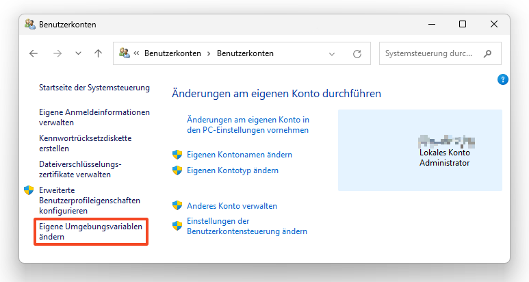
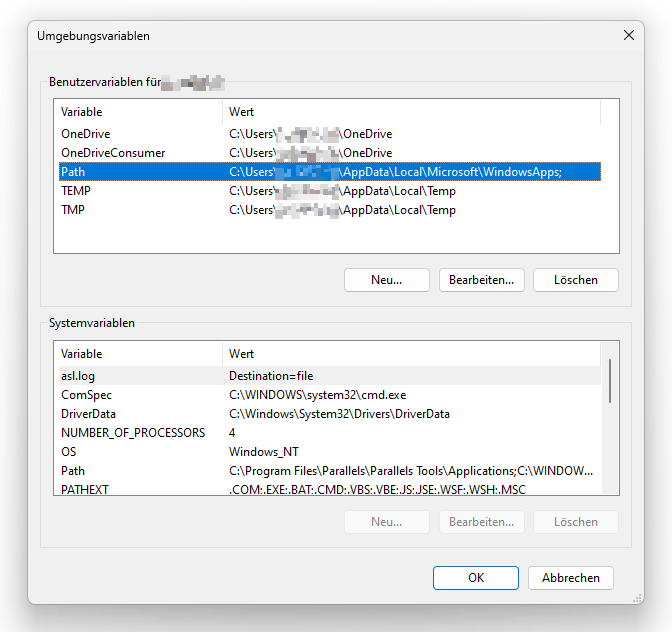
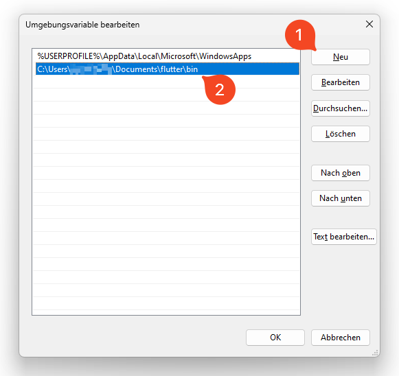
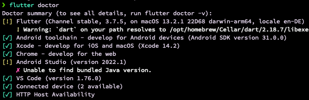

# Checklist

- [ ] Flutter SDK herunterladen. [🔗](#einrichtung-der-flutter-sdk)
- [ ] Flutter zur Umgebungsvariable `PATH` hinzufügen. [🔗](#den-pfad-aktualisieren)
- [ ] Android Studio und Plugins installieren. [🔗](#android-studio-installieren)
- [ ] `flutter doctor` Fehlermeldungen beheben. [🔗](#flutter-doctor-ausführen)
- [ ] USB-debugging vorbereiten. [🔗](#android-gerät-vorbereiten)

---

# Einrichtung der Flutter SDK

Wenn etwas unklar ist, wendet euch bitte an die offizielle Dokumentation:

&nbsp;&nbsp;&nbsp;&nbsp;&nbsp;&nbsp;
<a href="https://flutter.dev/docs/get-started/install/windows">
    
</a>&nbsp;&nbsp;&nbsp;&nbsp;
<a href="https://flutter.dev/docs/get-started/install/macos">
    
</a>&nbsp;&nbsp;&nbsp;&nbsp;
<a href="https://flutter.dev/docs/get-started/install/linux">
    
</a>

In dieser Anleitung wird die Installation **für Windows** beschrieben.

## Flutter SDK herunterladen

Clone die aktuelleste stabile release Version der Flutter SDK in einen gewünschten Installationsordner (z. B. `C:\Users\<your-user-name>\Documents`):

```bash
git clone https://github.com/flutter/flutter.git -b stable
```

> ☢️ **WARNUNG** ☢️ Installiere Flutter nicht in einem Pfad, der Sonderzeichen oder Leerzeichen enthält.
>
> ☢️ **WARNUNG** ☢️ Installiere Flutter nicht in einem Ordner wie `C:\Program Files\`, der erhöhte Rechte erfordert.

## Den Pfad aktualisieren

In **Systemsteuerung** > **Benutzerkonten** > **Benutzerkonten** tippe auf **Eigene Umgebungsvariablen ändern**.



Überprüfe unter **Benutzervariablen**, ob ein Eintrag namens **Path** existiert.
  - Wenn der Eintrag existiert: füge den vollen Pfad zu `flutter\bin` mit dem `;` Trennzeichen nach existierenden Werten hinzu.
  - Wenn der Eintrag nicht existiert: erstelle eine neue Variable namens `Path` mit dem vollen Pfad zu `flutter\bin`.





> ❗️ Alle vorhandenen Konsolenfenster müssen geschlossen und wieder geöffnet werden, damit diese Änderungen wirksam werden.

Am besten startet ihr an diesem Punkt einmal euren PC neu.

# Android Studio installieren


Installiere [**Android Studio**][105] ⬇️.

> Wenn ihr mögt, könnt ihr auch VS Code benutzen, aber im Praktikum werden wir Android Studio verwenden. Die Vorgehensweise ist jedoch sehr änlich. Siehe [**Anleitung**][106].

**Nach der Installation:** Im **Welcome Fenster** wähle _Configure_ auf der linken Seite, dann _Plugins_ und lade das **Flutter** und das **Dart** Plugin herunter.


## `flutter doctor` ausführen

Führe in einem Konsolenfenster den folgenden Befehl aus, um zu sehen, ob es irgendwelche Plattformabhängigkeiten gibt, welche noch zur Fertigstellung der Einrichtung benötigt werden:

```python
flutter doctor
```

> 🔍 Dieser Befehl überprüft deine Environment und gibt einen Bericht über den Zustand der Flutter Installation wieder. Checke die Ausgaben aufmerksam Schritt für Schritt. Am Ende solltest du bei allen Punkten Haken haben. Warnings können bleiben (**Chrome** und **Visual Studio Errors** können **unbeachtet** gelassen werden). Meistens hilft es, die error message einfach zu googeln.



* If Flutter cannot locate your installation of Android Studio, run `flutter config --android-studio-dir <directory>` to set the directory that Android Studio is installed to.
* *Bei Fehler* `cmdline-tools component is missing`: Installiere das **Command Line Tool** unter Android Studio (Welcome screen: More Actions > SDK Manager > Reiter: SDK Tools > Android SDK Command-line Tools (latest)). [ **Quelle**](https://stackoverflow.com/questions/68236007/i-am-getting-error-cmdline-tools-component-is-missing-after-installing-flutter)
* *Bei Fehler* `Android license status unknown`: Run `flutter doctor --android-licenses`
* [ **Flutter command is not found?**](https://stackoverflow.com/questions/50652071/flutter-command-not-found)
* `Waiting for another flutter command to release the startup lock` ➡️ [ **Solution**](https://stackoverflow.com/questions/51679269/waiting-for-another-flutter-command-to-release-the-startup-lock)
* `Android Studio (not installed)` ➡️ [ **Solution**](https://stackoverflow.com/questions/59647791/android-studio-not-installed-when-run-flutter-doctor-while-android-studio-in)
* `flutter doctor --android-licenses` gives a java error ➡️ [ **Solution**](https://stackoverflow.com/questions/61993738/flutter-doctor-android-licenses-gives-a-java-error)
* `Android sdkmanager tool not found` ➡️ [ **Solution**](https://stackoverflow.com/questions/60475481/flutter-doctor-error-android-sdkmanager-tool-not-found-windows/)

# Das BI-Vital Flutter Projekt

Im Welcome Screen von Android Studio auf **Open** drücken und den Ordner: `/bi-vital-flutter-app/bivital_flutterapp` aus dem geklonten Repo als Projekt hinzuzufügen (nicht den Wurzelordner `bi-vital-flutter-app`, sondern den Unterordner).

> #### ❓ Flutter SDK Pfad angeben
> >
> > Manchmal kann es passieren, dass trotz der Eingabe des Flutter SDK Pfades in Windows, der Pfad nicht in Android Studio übernommen wird. Um dies zu checken bzw. zu beheben, gehe zu:
> >
> > File > Settings > Language & Frameworks > Flutter > SDK
> >
> > und setze den Pfad zum Flutter SDK Repo aus Schritt 2 (z. B., `C:\Users\<your-user-name>\Documents\flutter`).
> >

## Android Gerät vorbereiten

1. **Entwickleroptionen** und **USB debugging** auf dem Gerät aktivieren.
   - Wenn das **Entwickleroptionen** Menü in den OS Einstellungen nicht zu finden ist, muss es vorher aktiviert werden. Dazu die Buildnummer (unter Telefoninfo, evtl Softwareinformationen) 7 Mal antippen. Siehe [**Dokumentation**][107].
2. Den [**Google USB Driver**][108] installieren in Android Studio.
3. Das Handy mit einem USB-Kabel am Computer anschließen. Wenn du auf deinem Gerät dazu aufgefordert wirst, autorisiere den Computer für den Zugriff auf das Gerät.
4. Führe nun `flutter devices` aus, um zu überprüfen, ob Flutter das angeschlossene Android-Gerät richtig erkannt hat.

---

Stellt euch sicher, dass ihr den Projekt Ordner in Android Studio öffnen könnt, und etwas ähnliches seht, wie hier:


---

[*<< Vorherige Seite*](introduction-to-git) | [🏠](home)

[101]: https://flutter.dev/docs/get-started/install/windows "Flutter - Windows install"
[102]: https://flutter.dev/docs/get-started/install/macos "Flutter - macOS install"
[103]: https://flutter.dev/docs/get-started/install/linux "Flutter - Linux install"
[104]: https://snapcraft.io/flutter "Install Flutter on Linux | Snapcraft"
[105]: https://developer.android.com/studio "Download Android Studio"
[106]: https://docs.flutter.dev/development/tools/vs-code "Visual Studio Code setup"
[107]: https://developer.android.com/studio/debug/dev-options "Configure on-device developer options"
[108]: https://developer.android.com/studio/run/win-usb "Get the Google USB Driver"
[109]: https://flutter.dev/docs/deployment/android "Build and release an Android app"
[110]: https://play.google.com/store/apps/details?id=com.inkwired.droidinfo&pli=1 "Droid Hardware Info - Apps on Google Play"
[111]: https://pub.dev "The official package repository for Dart and Flutter apps."
[112]: https://docs.flutter.dev/development/packages-and-plugins/using-packages#css-example "Example: Using the css_colors package"
[113]: https://dart.dev/codelabs/dart-cheatsheet "Dart cheatsheet"
[114]: https://developers.google.com/learn/pathways/intro-to-flutter?hl=en "Intro to Flutter"
[115]: https://pub.dev/publishers/google.dev/packages "Packages of publisher google.dev"
[116]: https://flutter.dev/docs/development/ui/layout/adaptive-responsive "Creating responsive and adaptive apps"
[117]: https://www.youtube.com/c/flutterdev "Flutter YouTube page"
[118]: https://flutter.dev/docs/codelabs "Flutter codelabs page"
[119]: https://docs.flutter.dev/deployment/ios "Build and release an iOS app"