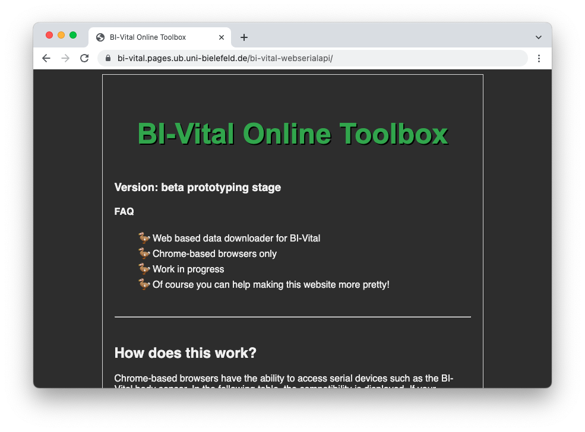
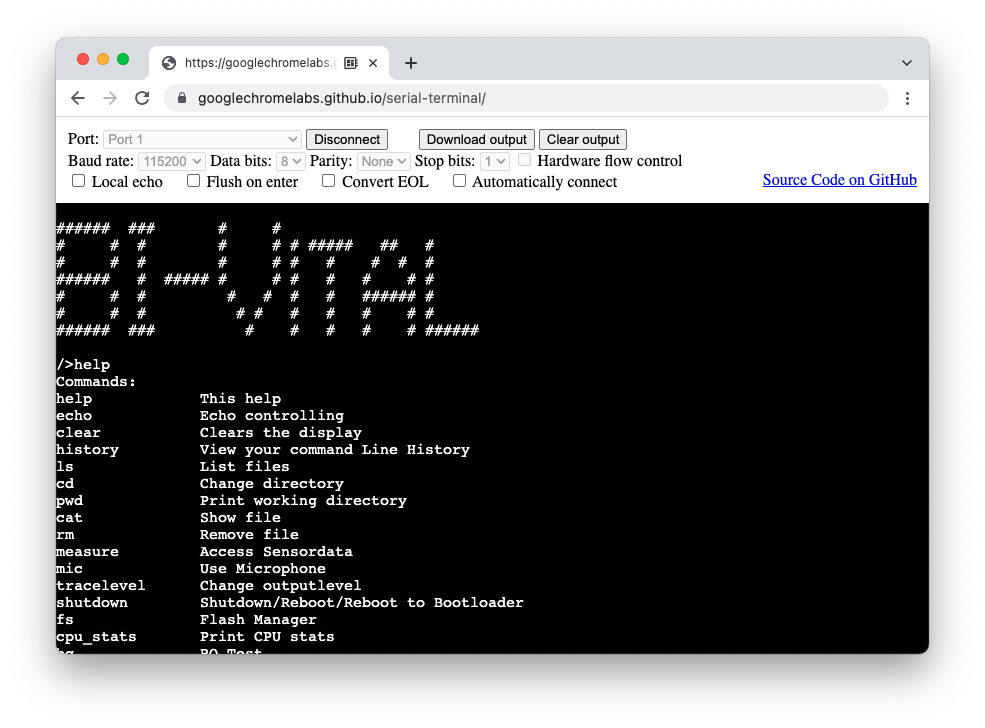
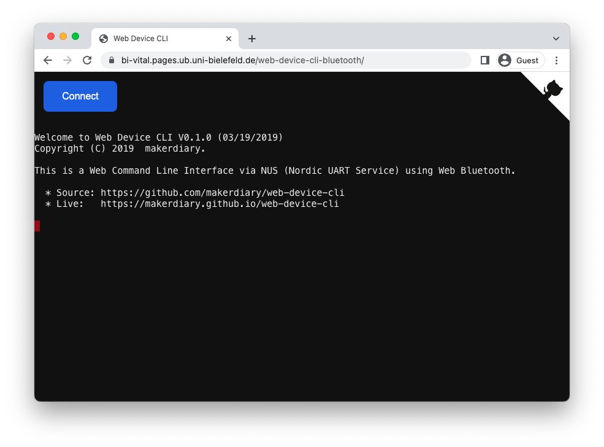
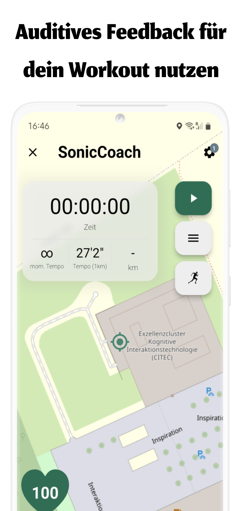

<style type="text/css">
    ol { list-style-type: lower-alpha; }
</style>

<style>
.image-grid {
    display: flex;
    flex-wrap: wrap;
    justify-content: center;
}

.image {
    width: calc(50% - 20px);
    margin: 10px;
    text-align: center;
}

.image p {
  margin-top: -15px;
}
</style>

<div style="display:flex;justify-content:space-between;">
    
    
</div>

<br><br>

##### CITEC, Inspiration 1, 33619 Bielefeld
### BioMechatronik Praktikum 2023

<br><br><br><br>

# Aufgabenzettel BI-Vital

## Wichtige Informationen

1. Bitte schalte den BI-Vital <mark>nach Gebrauch vollständig aus</mark>, indem du den <mark>User-Button etwa 5 Sekunden</mark> lang drückst, bis der LED Rainbow Mode angezeigt wird.
   ```bash
   shutdown -s
   ```

2. Stelle sicher, dass der BI-Vital vor der Verwendung <mark>vollständig aufgeladen</mark> ist (den Batteriestand kannst du in der BI-Vital-App einsehen) und dass <mark>ausreichend Speicherplatz</mark> zur Verfügung steht. Wenn nicht, formatiere den BI-Vital oder lösche einzelne Datenaufzeichnungen aus dem internen Speicher.

   ```bash
   power -bat # battery level in %
   fs -stat # prints storage space
   fs -format # format storage
   rm <filename> # delete file
   ```

3. Lasse die BI-Vital-<mark>App</mark> während der Aufzeichnung von Daten <mark>im Vordergrund</mark> laufen, um eine Unterbrechung der Bluetooth-Übertragung zu vermeiden.
4. Wenn der BI-Vital ungewöhnliches Verhalten zeigt, nutze den Reset-Button.

5. Zur optimalen Nutzung des BI-Vital stehen dir folgende Tools zur Verfügung. Bitte beachte, dass die Browser-Tools nur im **Google <mark>Chrome</mark> Browser** funktionieren:

<div class="image-grid">
  <div class="image">
    <a href="https://bi-vital.pages.ub.uni-bielefeld.de/bi-vital-webserialapi/">
        
        <p>Chrome BI-Vital Online Toolbox</p>
    </a>
  </div>
  <div class="image">
    <a href="https://googlechromelabs.github.io/serial-terminal/">
        
        <p>Chrome Online Terminal</p>
    </a>
  </div>
  <!--<div class="image">
    <a href="https://bi-vital.pages.ub.uni-bielefeld.de/web-device-cli-bluetooth/">
        
        <p>Chrome Online Bluetooth Terminal</p>
    </a>
  </div>-->
  <div class="image">
    <a href="https://play.google.com/store/apps/details?id=de.cit_ec.bivital">
        
        <p>Android BI-Vital App</p>
    </a>
  </div>
</div>

## 1. Aufgabe: BI-Vital USB Terminal

1. Verbinde dich mit dem BI-Vital über das [**Chrome USB-Terminal**](https://googlechromelabs.github.io/serial-terminal/) und führe einige grundlegende Befehle aus.\
Nutze die Hilfe-Funktion, um dir alle verfügbaren Befehle anzeigen zu lassen und ihre Funktionen zu verstehen.
   ```bash
   help
   ```
   Probiere ebenfalls die BI-Vital [**Chrome Online Toolbox**](https://bi-vital.pages.ub.uni-bielefeld.de/bi-vital-webserialapi/) aus.
1. Starte eine <mark>Live-Aufzeichnung</mark> der aktiven Sensorwerte und überprüfe, ob sie korrekt ausgegeben werden.
   ```bash
   measure -live
   ```

## 2. Aufgabe: BI-Vital Android App

<p align="center">
  
</p>

1. Lade die BI-Vital-App aus dem [**Google Play Store**](https://play.google.com/store/apps/details?id=de.cit_ec.bivital) herunter und verbinde dich per Bluetooth mit dem BI-Vital über die Einstellungen.
2. Nutze das Submodul <mark>*Data Plotter*</mark>, um die einzelnen Messwerte anzuzeigen. Ändere dabei sowohl die anzuzeigenden Sensoren als auch die Abtastrate und die Anzahl der gepufferter Werte.
3. Diskutiere mit deinem Partner über <mark>mögliche Anwendungsfälle der verschiedenen Sensoren</mark>.

## 3. Aufgabe: BI-Vital Schrittzähler

1. Konfiguriere den BI-Vital über ein [**serielles Terminal**](https://googlechromelabs.github.io/serial-terminal/) oder über die [**BI-Vital Chrome Online Toolbox**](https://bi-vital.pages.ub.uni-bielefeld.de/bi-vital-webserialapi/) so, dass die <mark>relevanten Sensoren für einen Schrittzähler</mark> erfasst werden.
   ```bash
   measure -conf
   ```
2. Erstellt gemeinsam <mark>2 Testdatensätze</mark> über jeweils exakt <mark>50 Schritte</mark>.
   ```bash
   measure -record
   measure -stop
   ```
3. Lade die Testdaten [**herunter**](https://bi-vital.pages.ub.uni-bielefeld.de/bi-vital-webserialapi/) und <mark>visualisiere</mark> sie in MATLAB, Python oder einer anderen Programmiersprache.
4. Entwickle einen <mark>Algorithmus zur Schritterkennung</mark> (z.B. in MATLAB mit der Funktion [*findpeaks*](https://de.mathworks.com/help/signal/ref/findpeaks.html), [**Peak Analysis**](https://de.mathworks.com/help/signal/ug/peak-analysis.html)) 
   ```
   findpeaks(y,x)
   ```
5. <mark>Formatiere</mark> den Speicher vom BI-Vital, so dass alle Datensätze aus dem Flashspeicher gelöscht werden. Kontrolliere mithilfe eines Befehls, ob tatsächlich alle Daten gelöscht wurden.
   ```bash
   fs -format
   ```

## 4. Aufgabe: Multimodale Sensorerfassung

1. Experimentiere mit verschiedenen Sensor-Konfigurationen, indem du schrittweise mehr Sensoren und schnellere Abtastraten hinzufügst.
1. Identifiziere, <mark>welche Probleme auftreten</mark> können, wenn zu viele Daten erfasst werden.
1. Nimm einen kurzen Datensatz mit einer möglichst maximal intakten Konfiguration auf und visualisiere die einzelnen Sensorwerte auf anschauliche Weise in MATLAB, Python oder einer anderen Programmiersprache.

## 5. Aufgabe: Verwendung des Mikrofons

1. Nimm eine <mark>einminütige Audioaufnahme</mark> mit dem BI-Vital auf und lade sie anschließend mithilfe des [**Chrome Download Tools**](https://bi-vital.pages.ub.uni-bielefeld.de/bi-vital-webserialapi/) herunter.
   ```bash
   mic -record
   mic -stop
   ```
2. Höre dir die Aufnahme an und nutze eine Programmiersprache deiner Wahl, wie MATLAB oder Python, um die Rohdaten zu visualisieren und weitere Informationen zu extrahieren.
3. Führe eine [**Fast Fourier Transformation**](https://de.mathworks.com/discovery/fft.html) ([*fft*](https://de.mathworks.com/help/matlab/ref/fft.html)) auf den Daten aus, um weitere <mark>Einblicke in das Audiosignal</mark> zu erhalten. Mit dieser Transformation kannst du zum Beispiel die Tonhöhe und Lautstärke des Signals analysieren.

## Extra-Aufgaben

1. **SonicCoach Sub-App**: Verwende die Sonification Anwendung in der BI-Vital-App, indem du den Brustgurt des BI-Vital am Körper trägst und deine Rückreise vom CITEC aufzeichnest. Die Musikgeschwindigkeit soll sich entsprechend deines Pulses ändern. Konfiguriere die Anwendung entsprechend.

<p align="center">
  
</p>

1. **EKG-Aufzeichnung**: Starte eine EKG-Messung auf dem BI-Vital und erfasse dabei nur das EKG-Signal und die Herzfrequenz. Führe während der Messung unterschiedliche Aktivitäten durch, die zu einer Veränderung der Herzfrequenz führen, z.B. Laufen oder Ruhephasen. Lade anschließend die Messwerte vom BI-Vital herunter und verwende eine Programmiersprache deiner Wahl, um die Daten einzulesen und anhand des EKG-Signals eine Berechnung der Herzfrequenz durchzuführen und somit die vom BI-Vital berechneten Herzfrequenzen zu reproduzieren.

# Serial Terminal commands

| command | short description | long description |
| - | - | - |
| `help` / `help <command>` |  |  |
| `echo` | Displays messages, or turns command echoing on or off | `echo <data_to_be_print>`<br>some special parameters:<br>`<bool>`&emsp;On/Off echo input characters |
| `clear` | Clears the display |  |
| `history` | Show commands history | `history (<optio>)`<br>`clear`&emsp;Clear history |
| `ls` | List files | `ls /<dir>`&emsp;List dir |
| `cd` | Change directory | `cd /dir`&emsp;Change dir<br>`cd /`&emsp;Root directory |
| `pwd` | Print working directory | `pwd` Print working directory |
| `cat` | Show file | `cat <filename>`&emsp;Show file<br>*check Convert EOL checkbox* |
| `rm` | Remove file | `rm <filename>`&emsp;Remove file |
| `measure` | Access Sensordata | Available options:<br>`-record`&emsp;record to filesystem<br>`-live`&emsp;show measurement in terminal<br>`-stop`&emsp;Stop active file record<br>`-tail`&emsp;show tail of ongoing record process<br>`-conf`&emsp;configure sensors settings<br>`-defaults`&emsp;to restore default/factory config settings<br>`-load`&emsp;load/update configs from ConfigFile |
| `mic` | Use Microphone | Available options:<br>`-record`&emsp;record to filesystem<br>`-stop`&emsp;Stop active file record |
| `tracelevel` | Set the level of debug infos to be printed | Available options:<br>`-off` <br>`-cmd` <br>`-error` <br>`-warn` <br>`-info` <br>`-all` |
| `shutdown` | Shutdown/Reboot/Reboot to Bootloader | Available options:<br>`-b`&emsp;Reboot to bootloader<br>`-s` or `-h`&emsp;Shipping mode/Hibernate<br>`-r`&emsp;Reboot |
| `fs` | Flash Manager | Available options:<br>`-stat`&emsp;Show statistics<br>`-format`&emsp;Format flash<br>`touch /<filename>`&emsp;Touch file. If file not exists > Create new file<br>`mkdir /<dirname>`&emsp;Create dirname<br>`write /<filename> \"Hello World\"`&emsp;Write Hello World to Filename |
| `cpu_stats` | Print CPU stats |  |
| `power` | Powermanagement (BQ2512) | Available options:<br>`-stat`&emsp;Print PowerManagement Stats<br>`-s`&emsp;Shutdown<br>`-r`&emsp;Reset Shipping (Shutdown)<br>`-bat`&emsp;Print Battery Level in % |
| `vib` | Vibration motor test |  |
