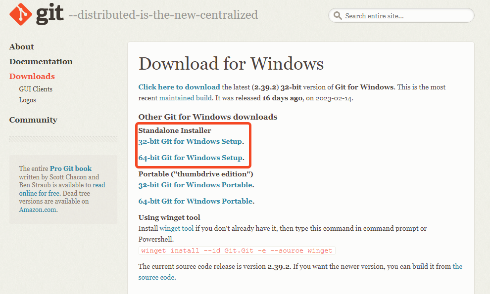

# [Git](https://git-scm.com/)

- free und open source
- ein Versionsverwaltungsprogramm
- beliebt und weit verbreitet

In seiner Grundfunktion tut Git nichts weiter, als Dateien, die ihr im "gebt",
zu verwalten, und die Änderungen zwischen verschiedenen Versionen zu registrieren.

Vorteile sind u. a.:

- In der Versionsgeschichte ist klar zu erkennen, was wann getan wurde.
- Sollte eine Version einmal nicht mehr funktionieren, könnt ihr einfach zum letzten funktionierenden Stand zurückkehren.
- Man kann gezielt einzelne Änderungen an einzelnen Dateien zurückverfolgen.

Und noch viele mehr.

>  Eine sehr ausführliche Einführung in die Arbeit mit Git bietet das kostenlose E-book [**Pro Git**](https://git-scm.com/book/en/v2) von Scott Chacon!
> <br clear="left"/>
>
> Es gibt darüber hinaus viele "Cheat Sheets", zum Beispiel [**dieses hier**](https://education.github.com/git-cheat-sheet-education.pdf).

## Installation

Ladet die neueste Version von der [**git Webseite**](https://git-scm.com/) runter und installiert Git.




> Es gibt natürlich eine Vielzahl an grafischen Tools und Helferlein, die sich gegenseitig mit Features für den Anwender übertrumpfen. Wenn ihr mit Git vertraut seid, könnt ihr gerne auch mit solchen Tools arbeiten.
>
> Android Studio verfügt allerdings über eine eingebaute UI für Git.

## Vor der ersten Verwendung

Bevor es los geht, müsst ihr Git mitteilen, wie ihr heißt. Das ist wichtig, um nachzuverfolgen, wer welche Änderungen eingebracht hat. Öffnet dazu die Git Konsole:

```bash
git config --global user.name "Euer Name"
git config --global user.email "eure.name@fh-bielefeld.de"
```

## Das Repository klonen unter Windows

Um mit an dem Projekt zu arbeiten, müsst ihr zunächst das repository klonen. 
Dazu findet ihr auf der [**Startseite des Projekts**]() <!---TODO:--> den blauen Button "Clone" und könnt das repository mit SSH oder HTTPS klonen.

> Falls ihr SSH nicht kennt, könnt ihr mit dem folgenden Befehl das Projekt mit HTTPS klonen.
>
> ```bash
> git clone https://gitlab.ub.uni-bielefeld.de/kevin.penner/biomechatronik-praktikum-2021.git
> ```
<!---TODO:-->

Anschließend müsst ihr euer Git-Passwort und -Benutzernamen eingeben.

> ❓ Falls ihr das Passwort oder den Benutzernamen zum Klonen falsch eingegeben habt, müssen diese manuell auf dem Rechner geändert werden, da git Bash euch nicht erneut danach fragt.
>
> Dazu geht ihr unter Systemsteuerung\Benutzerkonten\Anmeldeinformationsverwaltung auf "Windows-Anmeldeinformationen" und seht dann unter "generische Anmeldeinformationen" eine Zeile mit git. Dort drückt ihr auf den Pfeil rechts in der Zeile und dann auf "Bearbeiten." So könnt ihr das richtige Passwort und den Benutzernamen eingeben. Daraufhin könnt ihr das repository dann klonen mit:
>
> ```bash
> git clone https://gitlab.ub.uni-bielefeld.de/kevin.penner/biomechatronik-praktikum-2021.git
> ```
<!---TODO:-->

## Gitlab

Wir verwenden Git im Zusammenhang mit einem Git Server. Der Server ist in unserem Fall der Gitlab Server der Uni Bielefeld.
Für euch ist es nur wichtig zu wissen, dass euer lokales Projekt immer eine **vollständige** Kopie des Projektes auf der Serverseite ist. Ihr verfügt also immer über alle Daten und Dateien.

**Git kommuniziert nicht automatisch mit dem Server**. Wenn es also neue Änderungen bei euch gibt, oder auf dem Server, dann müsst ihr Git erst darauf hinweisen.

