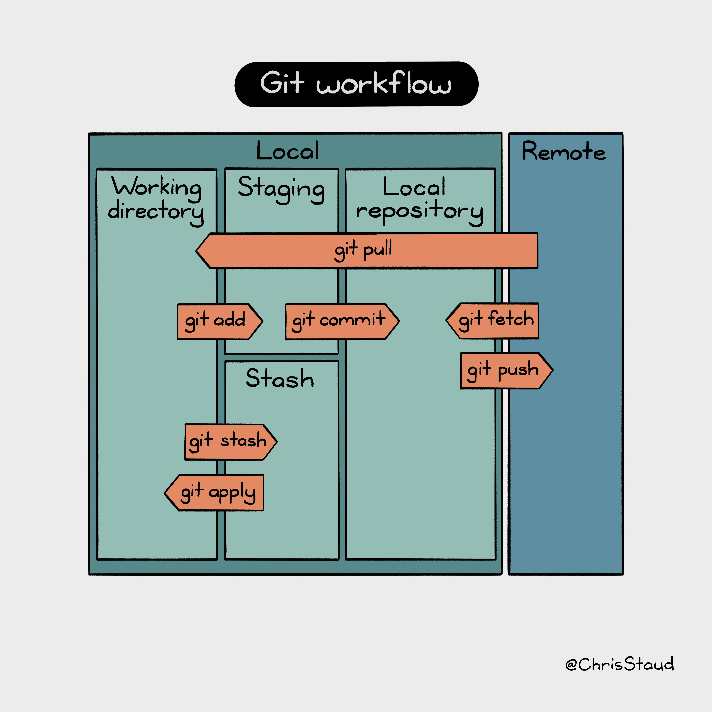

# Eine kurze Einführung in die Arbeit mit Git

[**Git**](https://git-scm.com/) ist ein Versionsverwaltungsprogramm, das unter Softwareentwicklern sehr beliebt und weit verbreitet ist.
In seiner Grundfunktion tut Git nichts weiter, als Dateien, die ihr im "gebt",
zu verwalten, und die Änderungen zwischen verschiedenen Versionen zu registrieren.

Vorteile sind u. a.:

- In der Versionsgeschichte ist klar zu erkennen, was wann getan wurde.
- Sollte eine Version einmal nicht mehr funktionieren, könnt ihr einfach zum letzten funktionierenden Stand zurückkehren.
- Man kann gezielt einzelne Änderungen an einzelnen Dateien zurückverfolgen.

Und noch viele mehr.

> 📖 Eine sehr ausführliche Einführung in die Arbeit mit Git bietet das kostenlose
> E-book [**"Pro Git" von "Scott Chacon"**](https://git-scm.com/book/en/v2)!
>
> Es gibt darüber hinaus viele "Cheat Sheets", zum Beispiel [**dieses hier**](https://education.github.com/git-cheat-sheet-education.pdf).

## Installation

Für Informationen zur Installation sollte die [**git Webseite**](https://git-scm.com/) zu Rate gezogen
werden.

> Es gibt natürlich eine Vielzahl an grafischen Tools und Helferlein, die sich
> gegenseitig mit Features für den Anwender übertrumpfen. Ihr könnt gerne auch
> mit solchen Tools arbeiten - aber haltet euch dennoch an die Regeln für das
> Beitragen zu neuem Code!
>
> Eine Einführung in grafische Tools müsst ihr euch dann ggf. wo anders suchen.
> In jedem Fall ist es hilfreich, die Grundlagen einmal nachvollzogen zu haben,
> da auch die grafischen Tools alle die selben Begriffe verwenden.

## Vor der ersten Verwendung

Bevor es los geht, müsst ihr Git mitteilen, wie ihr heißt. Das ist wichtig, um
nachzuverfolgen, wer welche Änderungen eingebracht hat. Öffnet dazu die Git Konsole:

```bash
git config --global user.name "Euer Name"
git config --global user.email "eure.name@fh-bielefeld.de"
```

## Das Repository klonen unter Windows

Um mit an dem Projekt zu arbeiten, müsst ihr zunächst das repository klonen. 
Dazu findet ihr auf der Startseite des Projekts den blauen Button "Clone" und könnt 
das repository mit SSH oder HTTPS klonen. Falls ihr SSH nicht kennt, 
könnt ihr mit dem folgenden Befehl das Projekt mit HTTPS klonen.


```bash
git clone https://gitlab.ub.uni-bielefeld.de/kevin.penner/biomechatronik-praktikum-2021.git
```

Anschließend müsst ihr euer Git-Passwort und -Benutzernamen eingeben.

> ❓ Falls ihr das Passwort oder den Benutzernamen zum Klonen falsch eingegeben habt, müssen diese manuell auf dem Rechner geändert werden, da git Bash euch nicht erneut danach fragt.
>
> Dazu geht ihr unter Systemsteuerung\Benutzerkonten\Anmeldeinformationsverwaltung 
auf "Windows-Anmeldeinformationen" und seht dann unter "generische Anmeldeinformationen" eine Zeile mit git. Dort drückt ihr auf den Pfeil rechts in der Zeile und dann auf 
"Bearbeiten." So könnt ihr das richtige Passwort und den Benutzernamen eingeben. 
Daraufhin könnt ihr das repository dann klonen mit:
>
> ```bash
> git clone https://gitlab.ub.uni-bielefeld.de/kevin.penner/biomechatronik-praktikum-2021.git
> ```

## Arbeiten mit Branches

Git arbeitet mit dem Konzept von "branches". Branches kann man sich als isolierte
Arbeitsumgebungen vorstellen, die bestimmte Versionen bestimmter Dateien beherbergen.
Der "Haupt"-branch eines Projektes heißt üblicherweise *master*. Dort befindet
sich in der Regel die neueste, stabile Version eines Projektes.

Wenn ihr mit Git arbeitet, empfiehlt es sich, Arbeiten **niemals** direkt im
Master-branch durchzuführen. Stattdessen eröffnet ihr einen neuen Branch, der
vom Master "abzweigt", und führt eure Änderungen dort durch. Spätestens, wenn
ihr mit mehreren Leuten an einem Projekt arbeitet, ist das unabdingbar.

Andernfalls kann es auch schnell einmal passieren, dass ihr nur "eine kleine
Änderung" einschiebt, und euer Projekt anschließend nicht mehr funtioniert.
Also vermeidet das, bitte.

Branches erstellt ihr im Projekt über die Gitlab Weboberfläche, nachdem ihr
ein Issue zu einem konkreten Anliegen erstellt habt.

> Ein Branch ist immer die Grundlage für eure Beiträge zum Projekt!
> Arbeitet niemals im master-Branch!

Innerhalb des Issues habt ihr dann einen Knopf, der euch anbietet, ein
"Merge-Request" zu erstellen. Für dieses Merge-Request wird dann ein eigener
Branch erstellt, auf dem ihr Änderungen beitragt, die **mit dem zugehörigen
Issue zu tun haben!**.
Sollte eine Änderung thematisch nicht zu eurem aktuellen Issue passen, dann
erzeugt ein neues Issue/einen neuen Branch. Das macht die Rückverfolgung
der Änderungen einfacher.

## Gitlab

Wir verwenden Git im Zusammenhang mit einem Git Server. Der Server ist in
unserem Fall der Gitlab Server der Uni Bielefeld.
Für euch ist es nur wichtig zu wissen, dass euer lokales Projekt immer eine
**vollständige** Kopie des Projektes auf der Serverseite ist. Ihr verfügt also
immer über alle Daten und Dateien.

**Git kommuniziert nicht automatisch mit dem Server**. Wenn es also neue
Änderungen bei euch gibt, oder auf dem Server, dann müsst ihr Git erst darauf
hinweisen. Das ist zum Beispiel dann nötig, wenn ihr grade ein neues Issue samt
Branch erstellt habt!
Um euch die neuesten "Infos" vom Server zu holen, verwendet ihr

```bash
git fetch origin
```

In der Ausgabe seht ihr dann ggf., dass es neue Branches gibt.
Wollt ihr euer lokales Projekt auf den Stand bringen, den der Git Server im
Moment hat, verwendet ihr

```bash
git pull origin
```

Es ist generell eine gute Idee, `git pull` wenigstens auf dem Master branch
regelmäßig auszuführen, wenn ihr mit den Matlab Codes selbst arbeiten wollt.
Wenn ihr zu zweit (oder mit noch mehr Leuten) auf einem Branch arbeitet, solltet
ihr das auch tun, da ihr sonst ggf. die Änderungen nicht bekommt, die eure Kollegen
erstellt haben.

Eine Liste aller verfügbaren Branches liefert euch:

```bash
git branch --all
```

Eine Liste der Branches auf eurem Rechner:

```bash
git branch
```

Eine Liste der Branches auf dem remote Server liefert:

```bash
git branch --remote
```

Hier tauchen dann z.B. auch die branches auf, die ihr über die Gitlab Oberfläche
erstellt habt. Um auf einen dieser branches zu wechseln verwendet ihr:

```bash
git checkout <Name des Branches>
```

Und jetzt könnt ihr Anfangen, eure Änderungen in das Projekt einzubringen.
Achtet darauf, dass ihr auf dem richtigen Branch arbeitet. Das ist umso wichtiger,
wenn ihr an mehreren Issues zeitgleich arbeiten wollt.

Der Befehl

```bash
git status
```

sagt euch, was sich in eurer lokalen Version des Projekts verändert hat.
Habt ihr zum Beispiel eine Datei bearbeitet, oder neu erzeugt, sind diese
in Git farblich rot hinterlegt.
Wollt ihr eure Änderungen in das Projekt mit aufnehmen, verwendet ihr

```bash
git add <Name der Datei>
```

Ihr könnt auf diese Weise mehrere Dateien markieren. In `git status` sind diese
dann grün hinterlegt. Um die Änderungen in die Versinsverwaltung zu schreiben
(also in die "Geschichte" des Projektes aufzunehmen), verwendet ihr dann

```bash
git commit
```

Wenn ihr den Befehl ausführt, öffnet sich (irgend-) ein Texteditor.
Hier gebt ihr eine Nachricht ein, die eure Änderung möglichst präzise
beschreibt. Auch das hilft dabei, nachzuvollziehen, was genau im Projekt
passiert ist.

> Achtet darauf, in sich schlüssige Änderungen als "commits" beizutragen.
> Sollte eure Änderung 4 verschiedene Dateien umschließen oder sehr, sehr viele
> Zeilen Code, spaltet euren Commit bitte in kleinere Änderungen auf.
> Es sollte niemals passieren, dass auch umfangreiche Issues in nur einem
> commit bearbeitet werden - Sollte hier ein Fehler auftreten ist die
> Rückverfolgung erheblich schwieriger.

Solltet ihr zwischenzeitlich vergessen haben, was genau ihr an einer Datei getan
habt, könnt ihr das mit

```bash
git diff <Name der Datei>
```

in Erfahrung bringen. Sofern die Datei bereits mit "git add" in das Projekt
aufgenommen wurde, lautet der Befehl stattdessen

```bash
git diff --cached <Name der Datei>
```

Wenn ihr euren aktualisierten Projektstand auf dem Server speichern wollt,
verwendet ihr den Befehl

```bash
git push origin
```

Beachtet, dass nur Änderungen, die ihr als "commits" in die Projekthistorie
aufgenommen habt, auf dem Server landen.


Wenn ihr der Meinung seid, dass ihr ein Issue vollständig bearbeitet habt und
das Problem behoben wurde, öffnet ihr die Gitlab Weboberfläche und navigiert
zu eurem Merge-Request. Dort drückt ihr auf den Knopf "Resolve VIP Status", und
folgt dann den Anweisungen in Gitlab.



# Einrichtung der Flutter SDK

Die ausführliche, englischsprachige Dokumentation zur Einrichtung befindet sich auf der offiziellen Webseite:

&nbsp;&nbsp;&nbsp;&nbsp;&nbsp;&nbsp;
<a href="https://flutter.dev/docs/get-started/install/windows">
    
</a>&nbsp;&nbsp;&nbsp;&nbsp;
<a href="https://flutter.dev/docs/get-started/install/macos">
    
</a>&nbsp;&nbsp;&nbsp;&nbsp;
<a href="https://flutter.dev/docs/get-started/install/linux">
    
</a>

In dieser Anleitung wird die Installation **auf Windows** beschrieben.

## 1) Flutter SDK herunterladen

Clone die aktuelleste stabile release Version der Flutter SDK in einen gewünschten Installationsordner (z. B. `C:\Users\<your-user-name>\Documents`):

> ☢️ **WARNUNG** ☢️ Installiere Flutter nicht in einem Ordner wie `C:\Program Files\`, der erhöhte Rechte erfordert.

## 2) Den Pfad aktualisieren

- Tippe in die Start Suchleiste von Windows `env` ein und wähle **Edit environment variables for your account**.
- Überprüfe unter **User variables**, ob ein Entrag namens **Path** existiert.
  - Wenn der Eintrag existiert: füge den vollen Pfad zu `flutter\bin` mit dem `;` Trennzeichen nach existierenden Werten hinzu.
  - Wenn der Eintrag nicht existiert: erstelle eine neue Variable namens `Path` mit dem vollen Pfad zu `flutter\bin`.

> ❗️ Alle vorhandenen Konsolenfenster müssen geschlossen und wieder geöffnet werden, damit diese Änderungen wirksam werden.

# Android Studio installieren


Installiere [**Android Studio**][105] ⬇️.

> Anstatt Android Studio kann auch VS Code verwendet werden. Siehe [**Anleitung**][106].

**Nach der Installation:** Im **Welcome Fenster** wähle _Configure_ auf der linken Seite, dann _Plugins_ und lade das **Flutter** und das **Dart** Plugin herunter.

## Android Studio Personalisierung

In den **Einstellungen**:
```dart
Editor
┣ General
┃ ┗ Code Folding
┃   ┗ General : // setze einen Haken bei *Documentation comments* und *Method bodies*
┣ Font : // *Enable font ligatures*
┣ Code Style
┃ ┗ Dart
┃   ┗ Line length: 200
Languages & Frameworks
┗ Flutter
  ┗ Editor : // setze einen Haken bei *Format code on save* und *Organize imports on save*
```


## `flutter doctor` ausführen

Führe in einem Konsolenfenster den folgenden Befehl aus, um zu sehen, ob es irgendwelche Plattformabhängigkeiten es gibt, welche noch zur Fertigstellung der Einrichtung benötigt werden:

```python
flutter doctor
```

> 🔍 Dieser Befehl überprüft deine Environment und gibt einen Bericht über den Zustand der Flutter Installation wieder. Checke die Ausgaben aufmerksam Schritt für Schritt (**Chrome** und **Visual Studio Errors** können **unbeachtet** gelassen werden).

* *Bei Fehler* `cmdline-tools component is missing`: Installiere das **Command Line Tool** unter Android Studio (Welcome screen: More Actions > SDK Manager > Reiter: SDK Tools > Android SDK Command-line Tools (latest))
* *Bei Fehler* `Android license status unknown`: Run `flutter doctor --android-licenses`

# Das BI-Vital Flutter Projekt

Im Welcome Screen von Android Studio auf **Open** drücken und den Ordner: `/bi-vital-flutter-app/bivital_flutterapp` aus dem geklonten Repo als Projekt hinzuzufügen.

> #### ❓ Flutter SDK Pfad angeben
> >
> > Manchmal kann es passieren, dass trotz der Eingabe des Flutter SDK Pfades in Windows, der Pfad nicht in Android Studio übernommen wird. Um dies zu checken bzw. zu beheben, gehe zu:
> >
> > File > Settings > Language & Frameworks > Flutter > SDK
> >
> > und setze den Pfad zum Flutter SDK Repo aus Schritt 2 (z. B., `C:\Users\<your-user-name>\Documents\flutter`).
> >

## 8) Android Gerät vorbereiten (nur für Debug Modus nötig)

1. **Entwickleroptionen** und **USB debugging** auf dem Gerät aktivieren.
   - Wenn das **Entwickleroptionen** Menü in den OS Einstellungen nicht zu finden ist, muss es vorher aktiviert werden. Dazu die Buildnummer (unter Telefoninfo, evtl Softwareinformationen) 7 Mal antippen. Siehe [**Dokumentation**][107].
2. Den [**Google USB Driver**][108] installieren in Android Studio.
3. Das Handy mit einem USB-Kabel am Computer anschließen. Wenn Sie auf Ihrem Gerät dazu aufgefordert werden, autorisieren Sie den Computer für den Zugriff auf das Gerät.

# Hilfsreiche Links

[**Dart cheatsheet**][113]\
[**Intro to Flutter**][114]\
Offizielle, regelmäßig aktualisierte [**Google.dev packages**][115]. Wenn möglich, benutze diese Packages\
[**Flutter YouTube page**][117]\
[**Flutter codelabs page**][118]

---

[*<< Vorherige Seite*](was-ist-flutter) | [*Nächste Seite >>*](ide-tipps)

[101]: https://flutter.dev/docs/get-started/install/windows "Flutter - Windows install"
[102]: https://flutter.dev/docs/get-started/install/macos "Flutter - macOS install"
[103]: https://flutter.dev/docs/get-started/install/linux "Flutter - Linux install"
[104]: https://snapcraft.io/flutter "Install Flutter on Linux | Snapcraft"
[105]: https://developer.android.com/studio "Download Android Studio"
[106]: https://docs.flutter.dev/development/tools/vs-code "Visual Studio Code setup"
[107]: https://developer.android.com/studio/debug/dev-options "Configure on-device developer options"
[108]: https://developer.android.com/studio/run/win-usb "Get the Google USB Driver"
[109]: https://flutter.dev/docs/deployment/android "Build and release an Android app"
[110]: https://play.google.com/store/apps/details?id=com.inkwired.droidinfo&pli=1 "Droid Hardware Info - Apps on Google Play"
[111]: https://pub.dev "The official package repository for Dart and Flutter apps."
[112]: https://docs.flutter.dev/development/packages-and-plugins/using-packages#css-example "Example: Using the css_colors package"
[113]: https://dart.dev/codelabs/dart-cheatsheet "Dart cheatsheet"
[114]: https://developers.google.com/learn/pathways/intro-to-flutter?hl=en "Intro to Flutter"
[115]: https://pub.dev/publishers/google.dev/packages "Packages of publisher google.dev"
[116]: https://flutter.dev/docs/development/ui/layout/adaptive-responsive "Creating responsive and adaptive apps"
[117]: https://www.youtube.com/c/flutterdev "Flutter YouTube page"
[118]: https://flutter.dev/docs/codelabs "Flutter codelabs page"
[119]: https://docs.flutter.dev/deployment/ios "Build and release an iOS app"